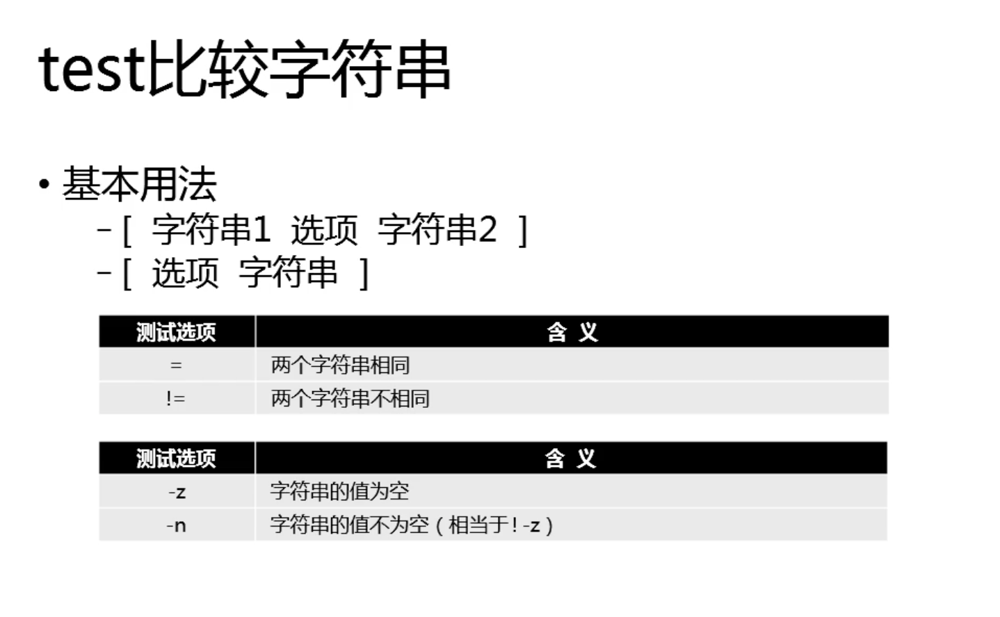
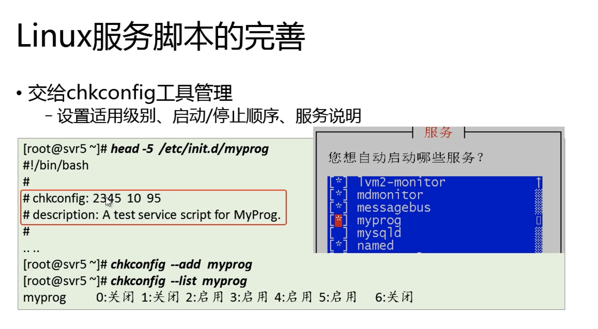

[toc]

脚本文件特征：需要一个解释器逐行解释文件

```shell
#!/bin/bash				//声明Shell环境（Sha-Bang）
```

## Shell脚本文件

### 如何运行shell脚本

**方法一：**作为制定Shell解释程序的参数

\- sh [~/path]    直接输入代码文件路径

\- . /path		或source ~/path后可直接执行（source和.一样作用，即解释执行代码文件）


**方法二：**作为独立运行的脚本程序

为Shell代码文件添加x权限，制定脚本路径即可运行

```shell
$ chmod +x ~/your/path.sh			# 添加可执行权限
$ ~/your/path.sh							# 运行指定的脚本程序
```


### 调试shell脚本

- 直接观察执行过程

  执行中的命令输出、报错等

- 开启调试模式

  可以清楚的告诉你，在执行每一步的时候输出了什么信息

  ```shell
  $ sh -x ~/your/path.sh
  ```

- 插入echo断点


## 免交互及输出处理

shell命令运行过程中会有多种交互信息，非常方便的提示了我们该如何进行操作、操作执行的状态等。但当其作为shell脚本文件运行的时候，我们往往只会关心特定的信息。如何从中摘选出我们需要的信息即为免交互处理。

## 命令组合运用

### 1. 命令分隔

#### 1.1. 顺序分隔 ;

使用分号(依次执行，只有先后，没有逻辑关系)

\- Cmd1 ; cmd2 ; cmd3 ...

#### 1.2. 逻辑“与”分隔 &&

逻辑关系为“与”，期望所有命令都能执行成功，一旦出现失败则后续命令不再执行

\- Cmd1 && cmd2 && cmd3 ...

make && make install

#### 1.3. 逻辑“或”分隔 ||

逻辑关系为“或”，执行到第一条成功的命令结束，之后的命令都不执行

典型应用：针对前置设定失败的情况，补充设置任务

id mickey || useradd mickey #若无此用户则创建用户

#### 1.4. 组合功能

命令1 && 命令2 || 命令3

命令1成功时执行命令2，不成功时执行命令3

### 2. 管道操作 pipe ｜

- 将命令的**屏幕输出信息**交给另一端的命令处理

```shell
$ ifconfig | less 						# 用less分页查看
```

- **范例1:**统计文件数量

```shell
$ find /etc -type f | wc -l 	# wc -l 统计行数
```

- **范例2:**统计监听状态等tcp端口数

```shell
$ netstat -anpt | grep -c "LISTEN"	# grep 过滤
```

### 3. 标准输入输出

unix like的系统中又一个基本思想，即一切皆是文件，即均以文件形式存在。普通文件、目录、键盘、鼠标……都以文件形式存在。要访问*硬件设备*，必须找到对应的设备文件。

#### 3.1. I/O交互设备

- 标准输入：从次设备接收用户输入的数据
- 标准输出：通过次设备想用户报告正常的命令输出结果
- 标准错误：通过此设备报告执行中的出错信息

#### 3.2. stdout与stderr

运行正常，将其屏幕信息报告给stdout设备

运行异常，将其屏幕信息报告给stderr设备

### 4. 重定向操作

重定向指的是，在运行脚本时，重新指定命令执行时I/O设备的的方向，比如：不使用默认的键盘、显示器，改用制定的文本文件


#### 


## 基本入门

### 1. Shell变量

#### 1.1 基本操作

##### 1.1.1 定义/赋值

- 基本格式

  ```shell
  $ # 变量名=变量值
  $ var=Ubuntu
  ```

  ⚠️注意：等号左右不能有空格

##### 1.1.2 查看/引用

- 基本格式

  ```shell
  $ # 引用变量 $变量名
  $ echo $var
  $ echo ${var} # 变量名与其他文本粘连混淆时，以{}界定
  ```

##### 1.1.3 取消变量

unset 变量名

#### 1.2 变量的种类及作用


shell更侧重于考虑使用类型，即变量用来做什么

1. **环境变量**

   - 配置文件：

     /etc/profile

     ~/.bash_profile

   - 相关操作：

     env：列出所有的环境变量

     set：列出所有的变量

   - 常见的环境变量：

     PWD PATH USER LOGNAME UID

     SHELL HOME PS1 PS2

2. **位置变量**

   在执行脚本时提供的命令行参数，如\$1 \$2...\${10} \${11}...

   

3. **预定义变量**

   用来保存脚本程序的执行信息，可以使用但不能为这些变量赋值

   

#### 1.3 变量值及范围控制

1. **引号再赋值**

- **\" 双引号字符串**
  - 在双引号内允许<kbd>$</kbd>扩展，可调用其他变量的值
  - 出现特殊字符时，可用<kbd>\\</kbd> 转译
  - 当变量值不包括空格、制表符等的时候，双引号通常被省略，有空格不可省略
- **\' 单引号字符串**
  - 所有字符均视为字符本身，不可调用变量
  - 不允许转译
- 常见转译字符
  - \n 换行符，\t 制表符
  - \\\, \\\",\\\# 等

2. **read读入变量值**

   基本语法格式：

   ```Shell
   $ # 基本格式
   $ read VAR1 VAR					# 可以分段录入多个变量
   $ read -p "prompt" VAR	# 可以现实一个提示信息
   ```

   静默取值

   - 启用 read -s 选项
   - 关闭输入的回显，适合读入敏感信息，提高安全性

3. **变量的作用范围**

- 局部变量

  - 当前定义此变量的Shell环境下有效
  - 自定义变量默认都是局部变量

- 全局变量

  - 在当前Shell和所有子Shell环境中都有效
  - 若子shell中赋值同名变量，优先调用子Shell中变量

- 发布全局变量

  ```shell
  $ export NAME[=VALUE]			# 发布全局变量
  $ export -n NAME 					# 取消全局变量属性
  ```

  - 直接定义并赋值变量，作为全局变量发布
  - 如果已有局部变量，发布不需要赋值
  - 取消全局变量，变量值在当前shell中并不会有影响

### 2.数值运算及处理

#### 2.1 基本运算方法

> 加 +	减 - 	乘* 	除/ 	取余%

1. expr命令工具

   ``` shell
   $ expr $int1 +-\*/ $int2
   ```

   - 乘法计算时应当采用<kbd>\\*</kbd>转译，避免被作为shell通配符
   - 运算符两侧需要有空格，引用变量需要用$引用
   - 计算结果直接显示在屏幕上

2. 算式替换 $[]

   ```shell
   $ echo $[int+-*/int2]
   ```

   - 乘法无需转译，运算符两侧可以无空格
   - 引用变量省略$
   - 计算结果替换表达式本身，结合echo才能显示到屏幕
   - $[]还可以用**乘方运算

3. 自增表达式

   

   - 极简化表示

     先运算后取值：++i 即i+=1；--i即i-=1

     先取值后运算：i++

   ```shell
   $ X=48 ; echo $[X++],$X
   48,49
   ```

   - let命令操作变量

     操作变量值运算，并保存新结果，不输出结果，查看结果需要用echo

     ``` shell
     $ X=48 ; Y=21
     $ let X++,Y/=3
     $ echo $X,$Y
     49,7
     ```

#### 2.2 随机整数 环境变量RANDOM

1. 环境变量RANDOM
   - 每次调用时，随机生成0-32757之间的整数
   - 结合echo命令可查看结果
2. 限制随机数范围
   - 扩大：暂时未知
   - 减小/限制 /100等方式可以调整范围

#### 2.3 整数序列 seq命令

根据制定条件输出一组整数，基本格式为：

```shell
$ seq 末数
$ seq 首数 末数
$ seq 首数 步长 末数
```

- 默认分隔符为"\n"

- 通过-s可自定义分隔符，如：

  ```shell
  $ seq -s' ' 10 2 20
  10 12 14 16 18 20
  ```

- 通过-w可以显示等宽效果，不足数会添加前置0

#### 2.4 小数相关

##### 2.4.1 小数运算

bash本身不支持小数操作，需要通过调用bc计算器才可以实现小数计算。（此处略）

##### 2.4.2 小数比较


### 3. 字符串处理

#### 3.1 截取子字符串

##### 3.1.1 使用expr命令

> MacOs下的expr似乎不支持substr

```shell
#- expr substr $VAR 开始位置 截取长度
$ VAR='IvanTest'
$ expr substr $VAR 1,6
IvanTe
```

##### 3.1.2 cut命令

cut命令更适合对命令的输出文本进行过滤。其基本用法如下：

```shell
# 起始-结束
$ command | cut -c start-end
# 一个例子
$ VAR=IvanTest		# 引号可省略
$ echo $VAR | cut -c 1-3
Iva

# 字段分隔
$ command | cut -d '分隔符' -f字段数
# 一个例子
$ VAR=IvanTestIt		# 引号可省略
$ echo $VAR | cut -dI -f2
vanTest
$ echo $VAR | cut -dI -f2 -f3 # 会显示I
vanTestIt
```

##### 3.1.3 ${}表达式

基本用法：

${VAR:开始位置:截取长度}

${VAR::截取长度}

注意，此处第一个起始位置的编号为0

#### 3.2 字符串替换

##### 3.2.1 ${}表达式

${var/old/new} #仅替换第一个old

${var//old/new} #替换所有的old

##### 3.2.2 tr单字替换工具

命令输出| tr 'abc' 'ABC'		#需要注意，是把a替换为A，不是abc替换为ABC

命令输出| tr -d 'abc'			# 删除所有的a、b、c字符

##### 3.2.3 路径分割


目录名称，指目标文件/目录所在的路径的名称，基本名称指目标文件/目录本身的名称。

1. dirname 取目录位置

   dirname 'string'

2. basename取基本名称

#### 3.3 随机字符串

常见的随机性工具

1. 随机数变量：RANDOM
   - 生成一个0-32767之间的整数
   - 无法生成字符串等
2. 特殊设备文件：/dev/urandom
   - 会生成一个含有字符、数字的文件，每次读取均不同
   - 其中会包含各种类似乱码的字符
3. UUID生成命令：uuidgen
   - 生成一个由字符、数字组成的代码，但中间有-连接

##### md5sum校验工具

> BSD中为md5

根据输入的文本计算出256位（32字符）的MD5编码值

输入文本有任何差异，编码结果都会不同


？用md5和cut生成一个8位的随机字符/用uuid和tr、cut来生成随机字符串

#### 3.4 命令替换

使用场景：

1. 在命令行中嵌入另一个命令的输出结果
2. 将命令的输出保存到指定变量

##### 3.4.1 使用<kbd>`</kbd>

\`命令\` 可获取命令的结果

##### 3.4.2 $()

$(命令)

好处：可以嵌套使用

### 4. 条件测试

#### 4.1 脚本的识别能力

脚本时别需要为命令执行提供直接的识别依据，比如：

- 前一条命令是否成功
- 文件或目录的读/写等状态
- 数值的大小
- 字符串是否匹配

##### 4.1.1 返回状态值 $?

$?可用于判断前一条命令是否执行成功。若果\$?的值为0，则前一条指令正常完成，若为1或其他值，则前一条命令失败或异常。


##### 4.1.2 专用测试工具 test

语法格式：

test 选项 参数

[选项 参数]





### 5. 流程控制

#### 5.1 选择分支结构 if

1. **单分支**

   if 条件测试

   ​	then 命令序列

   fi

2. **双分支**

   if 条件测试

   ​	then 命令序列1

   else 命令序列2

   fi

3. **多分支**

   if 条件测试1

   ​	then 命令序列1

   elif 条件测试2

   ​	then 命令序列2

   else 命令序列3

   fi

#### 5.x case分支结构

case 变量名 in

模式1)

​	命令序列1;;

模式2:

​	命令序列2;;

*)

​	默认命令序列	

esac

#### 5.2 for列表式循环结构

for 变量名 in 值列表

do

​	命令序列

done

#### 5.3 while条件循环结构

while 条件测试

do

​	命令序列

done

#### 5.4 中断及退出控制

1. 中断控制

   break：跳出当前所在循环体，执行循环体后的语句块

   continue：跳过循环体内剩下的语句，重新判断条件以便执行下一次循环

2. 退出控制

   exit：退出脚本，可以指定返回的状态值。默认的返回值是0

   exit n

### 6. 服务脚本

#### 6.1 Shell函数

在shell环境中，将一些需要重复运用的操作定义为公共的语句块，即可定义为函数。

基本格式：

```shell
# 基本格式
function func{
	expression
}
# 另一种基本格式
func(){
	expression
}
```

以上两种定义格式等效

##### 调用及参数传递

- 调用已定义的函数
  - 格式：函数名
  - 先定义才能调用，类似于脚本的“内部命令“
- 函数传值
  - 格式：函数名 值1 值2
  - 传递的值作为函数的“位置参数”（用$1……设定传递）


$0为当前脚本的执行路径



第一行为启动的脚本服务级别


2345 为开启


### 7. 文本相关操作

#### 7.1 文本的排序统计

##### 7.1.1 ls输出结果排序

ls默认输出为名称升序，竖项输出

-S	按文档大小降序排列

-t	按文档修改时间降序排列

-r	反序排列（如-rS）

##### 7.1.2 文本排序统计工具sort和uniq

1. **uniq去重工具**

   **用法：**

   uniq 文件

   命令|uniq

   默认是对排序好的文本进行去重，即只能把连续的几个重复文件给去掉。

   **典型应用：**

   sort example.txt | uniq

   sort example.txt | uniq -c #统计重复次数

2. **sort排序工具**

   用法1: sort 文件

   用法2: 命令 | sort

   常用选项：

   -u	去除重复行

   -n	按数字顺序升序排列

   -r	反向排序

   -k	优先对第几列的内容排序（第几个字段，后面需要加位置指定，可以理解为excel中按照第几列进行排序）

##### 7.1.3 tac rev反序输出

tac 从倒数第一行，反向向上读取，与cat相反（head -3 /etc/password | tac)

rev 每行字符为单位反序，与echo相反

##### 7.1.4 tee整合重定向

命令输出的局限性

- 标准输出、管道
  - 只能在当前终端上显示
  - 无法保存结果
- 重定向输出操作
  - 只保存到指定的文件
  - 无法显示结果


##### 7.1.5 unix2dos dos2unix

windows 换行 \r换行 \n回车

linux换行		\n换行

### 8.多参数处理

在linux中，命令所输入的参数列表长度是有限制的，比如ls、rm、cp、mv等命令

- 给出的参数长度不能超过2.5M
- 基于*匹配、find等方式处理大量文件时容易出错


#### Xargs 工具

- 根据给定的参数组（以行为单位）分批执行目标命令

  - 用法1: 提供参数的命令 | xargs 目标命令

    find / | xargs ls -lh

  - 用法2：xargs --arg-file=提供参数的文件 目标命令

### 9. expect预期交互控制


