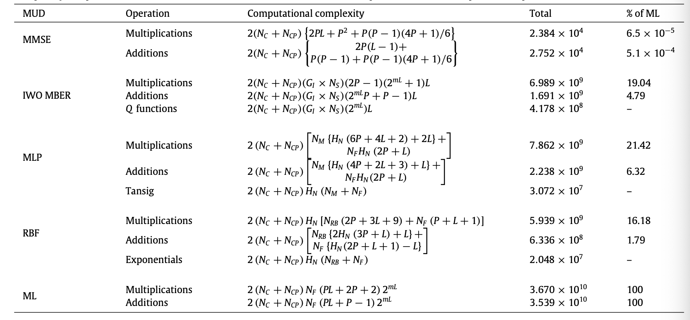

# 多用户检测相关技术总结

> 以通信技术进步为代表的科技进步使得社会不断地向前发展，正因如此，人们对它的要求一天比一天高。多用户检测技术是一种抑制多址干扰的新型技术，不仅引用了一定 的信息论，并且还通过了更为严格的理论分析，此技术以对多址干扰抑制甚至消 除为目的，其使用的主要手段就是各种信息处理手段，以实现对频谱资源的充分 利用，并达到对系统容量的提升。设计多用户通信系统中的关键挑战之一就是减轻干扰。

[toc]

## 1. 简单的信道模型

对于同步CDMA模型，不妨先假设仅有两个用户的情况。对于 $User_0$ ，假设其 $i$ 时刻要发送的信号比特为 $b_0(i)$ ，编码码元为 $M_0(i)$ 。同理对于 $User_1$ ，要发送的信号比特为 $b_1(i)$ ，编码码元为 $M_1(i)$。那么我们可以得到发送的信道模型 $Tx$ 为：$X(i)=M_0b_0+M_1b_1$ 。传输模型可以表示为：$Y(i)=HX(i)+n(i)$。现在我们来考虑接收处的情况， $User_0$ 接收端收到的信号，在匹配滤波过程中 $Rx_0$ 可以表示为：
$$
\begin{split}
&\frac{1}{N}\sum^{N}_{i=1}Y(i)M_0(i)\\
=&\frac{1}{N}\sum^{N}_{i=1}H(b_0M_0+b_1M_1)M_0+\frac{1}{N}\sum^{N}_{i=1}n(i)M_0\\
=&\frac{1}{N}\sum^{N}_{i=1}Hb_0M^2_0+
\frac{1}{N}\sum^{N}_{i=1}Hb_1M_0M_1+\widetilde{n}(i)\\
=&Hb_0+\frac{1}{N}\sum^{N}_{i=1}Hb_1M_0M_1+\widetilde{n}(i)
\end{split}
$$
式中 $Hb_0$是我们所希望获得的信号值，$\frac{1}{N}\sum^{N}_{i=1}Hb_1M_0M_1$ 是多用户所带来的干扰，而 $\widetilde{n}(i)$则是经过信道后仍然符合高斯分布的噪声。

对于多用户的情况，我们可以用一个 $N\times K$ 向量 $\boldsymbol{M}(i)$ 表示编码码元，么传输的信道就可以表示为：
$$
\boldsymbol{y}(i)=\boldsymbol{M}(i)\boldsymbol{b}(i)+\boldsymbol{n}(i)
$$
其中$N$为每个码元的编码码元长度，$K$为用户数量。

---

## 2. 简介及基本分类

### 2.1 多用户检测技术的基本简介

多用户检测最早主要指代的是指单个接收器联合检测、接收多个同时传输信号的场景，如蜂窝通信系统中每个小区的上行链路。或者说，多用户检测技术适用于在任何多入多出(MIMO)信道上传输的不同信号的联合检测。

与多用户检测密切相关的是干扰抑制。关键的区别是，多用户检测器试图检索多个(即至少两个)发射信号或信息流，而干扰抑制意味着接收机只对接收到的叠加发射信号中的一个信号感兴趣。[1]

对于多用户检测的研究最早是 K. S. Schneider 在 1979 年展开的[2]，他指出CDMA中如果把多个用户的码字以及定时信息联合起来使用，就可以实现对单个用户的信息进行检侧。但实际上真正推动对多用户检测研究的，是S. Verdu在1984年所提出的最优多用户检测器[3]。

> CDMA 系统被广泛运用在第三代蜂窝通信中。但在这个系统中，用户之间会出现一定的干扰，主要原因就是用户使用的是非同步和正交的扩频码，而且各个用户是随机接入系统的。一般把这种干扰称为多址干扰(MAI)，其干扰的原因就是非零互相关系数的存在。特别是上行链路的性能，对用户之间的接收功率变化非常敏感。这主要会引发两个问题：
>
> 1. 在实际的系统中用户都希望有较高的服务质量，就需要产生较大的信噪比，而这会对系统的容量产生严重的限制；
> 2. 系统的性能会受到“远近效应”的很大影响，弱信号会受到强信号的很大的抑制，比如靠近基站的用户的信号会对远离基站的用户造成过度干扰。

实际应用的**CDMA系统**通常使用闭环功率控制接收的功率变化以实现均衡。但S. Verdu 首先对多址干扰的基本结构进行了研究，认为导致干扰的首先原因并不在于 CDMA 系统，而是在于匹配滤波器的接收机的传统结构，为此要想消除 MAI，最根本的方法就是要改变传统的接收机的结构，针对这个问题，他提出了检测多用户的办法[3,4]，即最优检测器（ML），也正是由于这个原因更多的人对此技术开始进行深入地研究。

近些年，对于MUD的研究的热潮逐渐从CDMA转向了其他领域，比如**多天线MIMO**系统。如初始研究中的无线链路与多个天线的初始研究所示，通过将天线添加到单用户无线信道的发送器和/或接收器，可以显著的提高频谱效率和可靠性。 这刺激了MIMO信道的编码和接收技术的大量活动，因此几乎所有不断发展的无线系统和标准都包括多个发射天线的规定。 在这些场景中，多用户检测技术可用于缓解不同发射天线之间的干扰

### 2.2 多用户检测器的分类

根据处理方法进行分类，多用户检测器可以分为线性和非线性两类，对于前者来说，此检测器对由匹配滤波器输出的信号会给予线性变换处理，并且判决新产生的向量，它具有良好的性能;而对于后者，主要指干扰抵消型，该检测器会 估计和重建干扰信号，消除信号中的干扰，从而使系统的性能得以提高。

线性的检测器具有更为广泛的使用范围，主要就是因为它除了能解决误差扩散的缺陷，还能使复杂度进一步降低，而非线性的检测器则存在明显的误差扩散缺陷。

具体到线性检测又能将其分为<u>非盲</u>和<u>盲线性检测</u>，对于前者来说，其需要发送训练序列，占用了一定系统的资源，而盲线性检测则不需要。针对盲性检测，可以根据不同的准则来选择盲多用户检测算法的代价函数，常见的有约束最小输出能量和最小均方误差，以及恒模算法(CMA)等。

对于非线性的检测方法来说，不仅包括了判决反馈型，而且还包括了多级型，以及基于神经网络的一些方法。判决反馈型使用的方法是以单级结构的方式来完成多次循环。多级型网络按照每级用户的检测形式又可以进行分类，并行干扰抵消算法就是指每级的用户检测时并行地采用匹配滤波器，而串行干扰抵消算法是指用户按照信号的强弱不同利用串行匹配滤波器进行检测。神经网络相关的方法则是一个全新的领域。

---

## 3. 最优多用户检测器

### 3.1 Maximum Likelihood(ML)最大似然检测器

S. Verdu 在[3]中第一次提出了CDMA的ML解码器，本质上开启了了多用户检测领域。 与匹配的滤波器检测器不同，ML检测器的性能对用户之间的功率变化不敏感。 因此，这表明改善CDMA接收器可以放宽设计中最复杂的一个方面，对闭环功率控制的要求。ML检测器估计码元的公式如下：
$$
\hat{\boldsymbol{b}}=\arg\max_{\boldsymbol{b}}P(\boldsymbol{y}\ received\ |\boldsymbol{b}\ transmmitted)
$$
如果噪声是加性高斯噪声，那么也就可以说，ML检测器就是使得发送序列的各个信号等概率发送时满足下列最大似然准则：
$$
\hat{\boldsymbol{b}}=\arg\min_{\boldsymbol{b}}||\boldsymbol{y}-\boldsymbol{Mb}||
$$
其中，$\boldsymbol{b}$需要遍历所有可能的发送序列，即一个 $2^{K\times N}$的矩阵。**最大似然检测算法是当信道噪声为高斯白噪声时的最优检测算法**，理论上这种算法的误码率最低。虽然ML检测器几乎可以消除由于低到中等负载K/N(每个自由度的用户)的多用户干扰而导致的性能下降，但它有两个主要缺点:复杂性和需要的侧信息。

1. **ML检测需要遍历所有可能的发送信号序列**。因此，ML检测算法的复杂度随着天线呈指数增长，当发送信号采用高阶调制或者当系统的用户数目较多时，最大似然检测将不再适用。
2. ML检测算法需要获取信息 $\boldsymbol{M}$ ，才可以继续计算。

### 3.2 MAP(Maximum a posteriori)最大后验概率检测器

在MAP算法中，后验概率由似然函数和先验概率组成。由于引入了数据源的先验统计特性，理论上MAP算法在输入的数据先验概率不等时比最大似然估计算法（ML）估计得要准确，如果先验概率相等的话性能是相当的。
$$
\hat{\boldsymbol{b}}=\arg\max_{\boldsymbol{b}}P(\boldsymbol{b}\ transmmitted\ |\ \boldsymbol{y}\ received)
$$
对于异步CDMA，多用户MAP检测器可以使用标准的*forward-backward algorithm*实现[5]。MAP检测器具有与ML检测器相同的缺点，即复杂度随大小呈指数级增长，同时需要获取信息 $\boldsymbol{M}$。

<u>P.s. 以信道解码为例，最大似然译码等同于寻找最接近于接收向量的码字，最大后验概率的不同在于使符号(bit)出错的概率最小，而不是码字出错概率最小。1974年Bahl, Cocke, Jelinik and Raviv提出了一种基于MAP的译码算法BCJR，这是Turbo码算法的基础。</u>

---

## 4. 线性检测器

线性检测算法的原理，简单来说就是是通过一个检测滤波矩阵 $ \boldsymbol{W}$对收到的信号进行线性处理，把相互干扰重叠的信号分离开来，另我们复原出的信号结果的估计量为 $\hat{\boldsymbol{x}}$，则整个线性检测器的模型可以概括为：
$$
\hat{\boldsymbol{x}}=\boldsymbol{W}\boldsymbol{y}
$$
而不同的线性检测器的本质区别，其实就是这个检测滤波矩阵 $ \boldsymbol{W}$的差异

### 4.1 非盲型均衡器

#### 4.1.1 MRC最大比合并检测算法

MRC检测的原理是**对接收到的信号按照不同的比例系数进行合并运算，选择最优的合并矩阵使得处理后的信号信噪比最大**。当检测矩阵为信道矩阵的共轭转置时，可以消除信道对发送信号相位的影响，从而使得处理后的信号信噪比最大，即:
$$
\hat{\boldsymbol{x}}=\boldsymbol{H}^H\boldsymbol{H}\boldsymbol{x}+\boldsymbol{H}^H\boldsymbol{n}
$$
对与MIMO多天线系统的情形，当基站天线数目远大于用户数时，可以近似认为信道矩阵的每一列都是正交的，此时  $\boldsymbol{H}^H\boldsymbol{H}$ 近似为对角矩阵，可以显著的减小用户间的干扰。同时，MRC检测在对噪声信号处理的过程中，并没有对噪声信号放大，所以当信道条件不太理想或者天线数目远大于用户数目时，MRC是一个不错的方案。

#### 4.1.2 ZF(Zero Force)迫零检测算法

ZF检测算法的原理是**借助信道矩阵的伪逆矩阵把相互干扰的发送信号分开，实现信号的分层检测**，信号的估计值可以表示为：
$$
\begin{split}
\hat{\boldsymbol{x}}=&
(\boldsymbol{H}^H\boldsymbol{H})^{-1}\boldsymbol{H}^H\boldsymbol{y}\\
=&(\boldsymbol{H}^H\boldsymbol{H})^{-1}\boldsymbol{H}^H\boldsymbol{H}\boldsymbol{x}+
(\boldsymbol{H}^H\boldsymbol{H})^{-1}\boldsymbol{H}^H\boldsymbol{n}
\end{split}
$$
可以看出如果没有噪声的干扰，ZF检测可以准确的恢复出发送信号。存在噪声影响的情形下，信号的准确值和估计值之间存在 $(\boldsymbol{H}^H\boldsymbol{H})^{-1}\boldsymbol{H}^H\boldsymbol{n}$的误差，和MRC检测相比，ZF检测把噪声信号放大了 $(\boldsymbol{H}^H\boldsymbol{H})^{-1}$倍**，所以ZF检测算法抗噪声性能很差**。

#### 4.1.3 MMSE(Minimum Mean Square Error)最小均方误差检测算法

ZF检测算法虽然复杂度低，但是它有放大噪声的缺点，为了提高性能，在设计滤波矩阵的时候应该充分考虑噪声的影响，于是就有了MMSE检测算法。LMMSE检测的原理是：使检测到的信号估计值和实际值之间的均方误差最小，即
$$
\boldsymbol{W}=\arg\min_\boldsymbol{W}||\boldsymbol{x}-\boldsymbol{W}\boldsymbol{y}||^2_2
$$
这是一个凸函数优化的问题，因此可以对 $\boldsymbol{W}$ 求导，当偏导数为零时，得最优解。当**接收信号和估计误差正交时，估计信号与准确信号间的均方误差最小**，也就是说，$MSE=E[|\hat{x}-x|^2]$ ，即：
$$
E[(\boldsymbol{W}\boldsymbol{y}-\boldsymbol{x})\boldsymbol{y}^H]=0
$$
通过化简可得：
$$
\hat{\boldsymbol{W}}=(\boldsymbol{H}^H\boldsymbol{H}+2\sigma_n^2\boldsymbol{I}_P)^{-1}\boldsymbol{H}^H
$$
其中，$\sigma_n^2$是信道噪声的方差，由此可以看出，MMSE检测在ZF检测的基础上加上了 $\sigma_n^2\boldsymbol{I}_P$的修正项，求逆之后的特征值不会很小，不容易成为奇异矩阵。MMSE考虑了噪声对系统的影响，在信噪比低时，噪声对ZF检测影响会更严重，MMSE检测性能优于ZF检测；**当信噪比增高时，MMSE检测逐渐收敛于ZF检测**。但同时MMSE检测算法和ZF一样，会将噪声过度放大，从而影响了最终判决的性能，且MMSE比ZF的的复杂度略高。

经过MMSE检测后，新到的估计值可以表示为：
$$
\hat{\boldsymbol{x}}=(\boldsymbol{H}^H\boldsymbol{H}+2\sigma_n^2\boldsymbol{I}_P)^{-1}\boldsymbol{H}^H\boldsymbol{y}
$$

#### 4.1.4 其他线性算法（最小比特误差、最小码元误差）

<kbd>由于时间原因还没看</kbd>

==MBER、MSER==，在综述[6]中给出了定义式，MBER在[7-9]进行了详细的讨论，MSER在[10,11]中进行了讨论。

---

### 4.2 线性盲源信号分离

> 盲源分离是指在未知源信号和系统混合参数的情况下，依据源信号的特性，仅从观测的混合信号中分离或提取各个源信号的方法。

#### 4.2.1 盲源信号分离基本概念

盲源分离技术发展至今，涌现出了众多的经典算法理论，依据源信号的特性可将盲源分离算法理论大致划分为四类:

- 独立成分分析(Independent Component Analysis, ICA)

  <kbd>经典算法</kbd>

  > 独立成分分析，即基于源信号独立性的盲源分离理论，发展最早、较为成熟的盲源分离技术

  代表性算法：

  - 最大信息化(Infomax)方法	[13]
  - 自然梯度(Natural Gradient)[14]
  - 等变化自适应方法(EASI).      [14]
  - 特征矩阵联合近似对角化法(JADE)[15]
  - 快速独立成分分析算法(FastICA)[16]
  - 矩阵特征值分解方法             [17]

- 稀疏成分分析(Sparse Component Analysis，SCA)

  <kbd>当前热门</kbd>

  > 借助源信号的稀疏性或源信号在某个变换域(短时傅里叶变换、小波变换等)中的稀疏特性来实现盲源分离。
  >
  > 稀疏成分分析是现今的热门研究方向，是实现**欠定盲源分离**的重要技术，并且与压缩感知技术有着密切的联系。

  典型算法：

  -  TIFROM (Time Frequency Ratio of Mixtures)
  -  DUET(Degenerate Unmixing Estimation Technique）

- 非负矩阵分解(Non-Negative Matrix Factorization，NMF)

  <kbd>当前热门</kbd>

  > 限定了源信号和混合系数都是非负的，利用信息论中定义的不同散度/距离公式建立代价函数实现盲源分离，主要应用于图像与语音信号的分离

- 有界成分分析(Bounded Component Analysis， BCA)

  > 是一个较新的盲源分离技术，其算法思想是一句源信号的字符集的有限几何特性，利用凸集合原理建立代价函数实现源信号的分离或提取。
  >
  > 这个特性适用于通信调制混合信号的盲信号分离，因为通信调制信号具有字符集有限的特征，容易满足有界成分分析的分离条件。还可以依据其他源信号的几何特性来实现盲信号分离，如字符恒模性、字符集的势、最小统计域、最小零阶瑞利熵和凸边界等，这些都是实现有界成分分析盲信号分离的可用原则。

#### 4.2.2 盲自适应算法

盲自适应多用户检测是 1995 年由 Honig 等人[18]首次提出的，使用的优化准则 是最小输出能量(MOE)。在加性高斯白噪声(AWGN)信道下，基于 MOE 准则 的盲多用户检测器等价于 MMSE 多用户检测器。

对于盲自适应算法来说，主要的目标可以分为两步：1）将代价函数确定下来；2）把迭代算法确定下来。

对于<u>代价函数</u>而言，目前最常用的函数就是**最小输出能量**和**最小均方误差**，以及**恒模(CMA)**等。

而对于<u>迭代算法</u>来说，其最常用的就是最小均方(LMS) 迭代算法和递归最小二乘(RLS)迭代算法。LMS 迭代算法的优点在于稳定性好、实现简单、计算量小，其缺点在 于收敛速度慢，跟踪能力弱。而与 LMS 算法相比，RLS 算法具有更快的收敛速度， 以及更强的跟踪能力。不过，RLS 算法存在不稳定的问题，尤其是在背景噪声 的能量比较低的环境下，容易产生病态矩阵。也有运用 Kalman 滤波自适应实现多用户检测的思想[19]。

#### 4.2.3 盲自适应多用户检测算法

<kbd>由于时间原因还没看</kbd>

根据文献[20]，主要的算法有：

- 基于约束最小输出能量(CMOE)准则的算法
- 基于恒模的算法
- 基于子空间的算法
- 基于高阶统计量的算法

其中，CMOE和MMSE只差了一个常数，本质上是同一种算法。

具体的盲多用户分离类问题在*<u>Advanced in Multiuser Detection</u>*的第三章==*Blind Multiuser Detection in Fading Channel*== 有十分详细的讨论[21]。

---

## 5. 非线性检测器

### 5.1 干扰抵消检测器（判决反馈）

线性检测虽然复杂度低，但是性能太差。为了提高信号检测的可靠性，可以利用**判决反馈**的原理。即当已经检测出这层符号时，就将其从待检测符号中消除再继续检测其它信号。这样就减小了干扰，提高了判决的可靠性，同时**积累了分集增益**。

干扰消除包括：

- 并行干扰消除(Parallel Interference Cancellation, PIC)

- 串行干扰消除(Successive Interference Cancellation,SIC)

- 噪声预测部分判决反馈(Noise Predictive Partial Detection Decision Feedback, NP-PDF)算法

- 排序干扰消除算法(Order Successive Interference Cancellation, OSIC)

#### 5.1.1 串行干扰消除检测算法(SIC)

串行干扰消除的基本思想是首先检测出某一信源的信号，然后从接收信号中抵消这一发送天线信号造成的干扰，逐层迭代，最后完成整个信号矢量的检测。在干扰消除过程中，前一级的检测性能直接影响到后一级检测的可靠性，如果前一级检测出错则会蔓延到下一级，所以存在误差传播的影响。

在SIC检测算法中，**各层分级增益不相同**，第一层信号的分集增益最小，为了提高性能，检测顺序很重要，需要将可靠的信号层先检测以降低误差传播。于是提出了排序串行干扰消除算法(OSIC)。它的基本思想是：尽可能的提高前一级信号检测的可靠性以达到提高SIC的检测性能的目的，如果每一次检测出的信号都是待检测信号中可靠性最高的，则此时SIC性能最好。按照检测准则的不同，有基于ZF准则的OSIC和基于MMSE准则的OSIC。

#### 5.1.2 并行干扰消除检测算法(PIC)

并行干扰消除检测算法采用并行的方式消除符号间的干扰，即在**所有符号被解调之后，同时将干扰从接收信号中消除。**通常需要两个阶段来完成检测，首先使用一种低复杂度的检测器得到发射信号的初始估计值，然后第二个阶段检测某一信号时，用初始估计值表示所有其它层信号的干扰，在去掉其它层信号的干扰之后进行判决，得到该层信号的最终估计值。

其中第一阶段的预检测处理方法，可以是线性检测，如MMSE检测、ZF检测，也可以是其它检测方法，如QR分解法。PIC算法与SIC算法不同的是，不需要层排序算法，而只是通过各层信号并行检测即可显著减小检测时延，因此复杂度相对较低，但和SIC仍为同一数量级。

### 5.2 基于神经网络的检测器

文献[6]中，总结了最新的多用户检测技术的进展，由于模式分类能力，神经网络在一些通信系统的信号检测和信道均衡方面是很有前途的技术。通常在多用户系统中，多个用户的信号会相互干扰，这些信号需要在接收端进行适当的分类。当通信系统中的信号分类需要一个**非线性解**时，神经网络可以更加逼近最优解。网络还具有高度的并行性和对系统参数的适应性。因此，这些模型已经成为经典MUD的一个有吸引力的替代品。特别是基于***MLP(Multilayer Perceptron)***和***RBF(Radial Basis Function )***的MUD神经网络模型引起了广泛的研究关注。MLP和RBF网络都有自己的非线性分类机制。MLP网络以任意形状的非线性决策边界对输入模式进行分类，RBF网络以超曲面或椭圆形式对输入模式进行分类。

文献[6]中进行对比的结果如下，可以发现，神经网络的性能比传统方法更加优越，更接近于最优接收机的性能。

算法复杂度对比如下：

其他还有一些新颖的神经网络技术，还未深究。

## 6. 其他检测技术

## *部分Reference

==\1.     Honig, M.L., *Overview of Multiuser Detection*, in *Advances in Multiuser Detection*. 2009. p. 1-45.==

\2.     Schneider, K.S., *Optimum Detection of Code Division Multiplexed Signals.* IEEE Transactions on Aerospace and Electronic Systems, 1979. **AES-15**(1): p. 181-185.

\3.     Verdu, S., *Optimum Multiuser Asymptotic Efficiency.* IEEE Transactions on Communications, 1986. **34**(9): p. 890-897.

\4.     Verdu, S., *Minimum probability of error for asynchronous Gaussian multiple-access channels.* IEEE Transactions on Information Theory, 1986. **32**(1): p. 85-96.

\5.     Verdu, S., *Multiuser Detection*. 1998, Cambridge University Press.

\6.     Bagadi, K.P., V. Annepu, and S. Das, *Recent trends in multiuser detection techniques for SDMA–OFDM communication system.* Physical Communication, 2016. **20**: p. 93-108.

\7.     Alias, M.Y., S. Chen, and L. Hanzo, *Multiple-antenna-aided OFDM employing genetic-algorithm-assisted minimum bit error rate multiuser detection.* IEEE Transactions on Vehicular Technology, 2005. **54**(5): p. 1713-1721.

\8.     Ababneh, J.I., T.F. Aldalgamouni, and A.A. Alqudah. *Minimum bit error rate multiuser detection of SDMA-OFDM system using differential evolutionary algorithm*. in *2010 IEEE 6th International Conference on Wireless and Mobile Computing, Networking and Communications*. 2010. IEEE.

\9.     Zaka, I., et al. *Minimum bit error rate multiuser detection for OFDM-SDMA using particle swarm optimization*. in *International Conference on Intelligent Computing*. 2007. Springer.

\10.    Zhang, J., et al., *Turbo multi-user detection for OFDM/SDMA systems relying on differential evolution aided iterative channel estimation.* IEEE Transactions on Communications, 2012. **60**(6): p. 1621-1633.

\11.    Zhang, J., et al. *Differential evolution algorithm aided minimum symbol error rate multi-user detection for multi-user OFDM/SDMA systems*. in *2012 IEEE 75th Vehicular Technology Conference (VTC Spring)*. 2012. IEEE.

==\12.    Reynolds, D., H.V. Poor, and X. Wang, *Blind Multiuser Detection in Fading Channels*, in *Advances in Multiuser Detection*. 2009. p. 127-187.==

